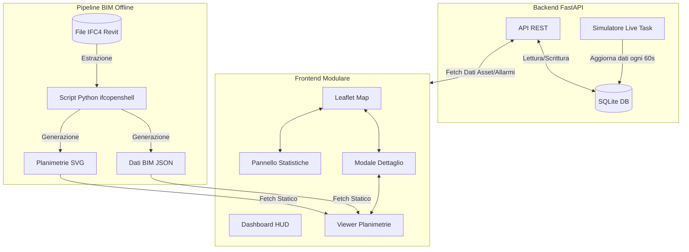

# Architettura GIS Asset Manager v1.2

Questo documento descrive l'architettura del dimostratore GIS Asset Manager, il flusso dei dati e la struttura dei moduli frontend e backend.

## Flusso Dati e Componenti

Il sistema si basa su un'architettura client-server leggera, progettata per essere facilmente distribuibile su piattaforme PaaS come Render.com.

---

## Architettura Frontend (Moduli JS)

Nella versione 1.2, il frontend è stato rifattorizzato da un singolo file monolitico a una struttura modulare per facilitare la manutenzione e l'estensione.

| Modulo | Responsabilità Principali |
|---|---|
| `config.js` | Configurazioni centralizzate: token mappe, intervalli di polling, ID asset BIM, mapping colori. |
| `map-config.js` | Inizializzazione della mappa Leaflet, definizione dei layer (Light/Dark), configurazione dei cluster e dei controlli base. |
| `map-core.js` | Gestione dei marker degli asset, disegno delle rotte marittime/terrestri, rendering dell'HUD, gestione eventi mappa e filtri di ricerca. |
| `map-modal.js` | Logica della modale di dettaglio asset: tabulazione (Anagrafica, Monitoraggio, ESG, Allarmi, WO, Documenti), grafici D3.js, rendering dati. |
| `map-bim.js` | Gestione della tab Planimetria/BIM: caricamento inline degli SVG, logica dei tooltip interattivi (mouseover/click) sugli spazi IFC, rendering della scheda dati tecnici BIM. |
| `map-stats.js` | Logica del pannello laterale a scomparsa, aggregazione dati per la panoramica operativa, gestione del polling live (aggiornamento automatico ogni 60s). |

---

## Pipeline BIM (Light BIM)

Il sistema implementa un approccio "Light BIM": invece di caricare un pesante modello 3D nel browser, estrae le informazioni rilevanti offline e le serve come asset statici leggeri.

### 1. Sorgente Dati
Il modello di partenza è un file IFC4 generato da Autodesk Revit, contenente discipline Architettoniche, Strutturali e Impiantistiche (MEP) con livello di dettaglio LOD350.

### 2. Estrazione e Trasformazione (Script Python)
- **`extract_ifc4_full.py`**: Utilizza `ifcopenshell` per analizzare il file IFC. Estrae l'albero spaziale (Project → Site → Building → Storey → Space), calcola le superfici nette e conta gli elementi per disciplina (pareti, porte, condotti HVAC, tubazioni, ecc.).
- **`translate_spaces.py`**: Converte i nomi tecnici o numerici degli spazi in etichette italiane leggibili, basandosi sul tipo di spazio (`IfcSpaceType`).
- **`gen_svg_from_ifc.py`**: Estrae le geometrie 2D (`IfcPolyline`, `IfcExtrudedAreaSolid`) di ogni spazio e genera file SVG per ogni piano. Inietta attributi `data-*` (nome, area, tipo, GUID) nei tag `<rect>` per consentire l'interattività frontend.

### 3. Visualizzazione (Frontend)
Il modulo `map-bim.js` carica il file SVG corrispondente al piano selezionato iniettandolo direttamente nel DOM (`innerHTML`). Questo permette di agganciare event listener Javascript ai singoli locali, abilitando tooltip interattivi che mostrano i dati estratti (superficie, tipo, GUID) al passaggio del mouse.

---

## Backend e Database

Il backend è un'applicazione FastAPI minimale che funge da strato di accesso ai dati e simulatore.

### Database Schema (SQLite)
- **`assets`**: Anagrafica base (ID, nome, tipo, coordinate, stato).
- **`telemetry`**: Dati operativi (mezzi disponibili, temperatura, energia).
- **`esg_metrics`**: KPI di sostenibilità (emissioni CO2, rating energetico).
- **`alarms`**: Storico allarmi generati dal simulatore.
- **`work_orders`**: Ordini di manutenzione associati agli asset.

### Simulatore Live (`simula_dati_live`)
Un task asincrono in background (`asyncio.sleep(60)`) che aggiorna le metriche operative di ogni asset.
- Applica logiche differenziate per tipo di asset (es. uffici vs stabilimenti).
- Simula cicli giorno/notte (valori minimi fuori dall'orario lavorativo).
- Genera allarmi quando le metriche superano le soglie percentuali predefinite.
